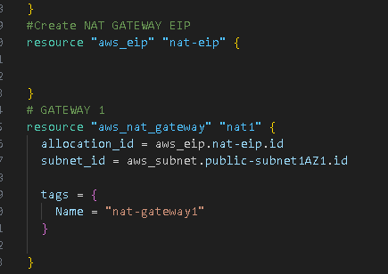
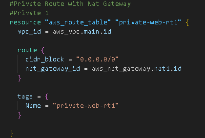
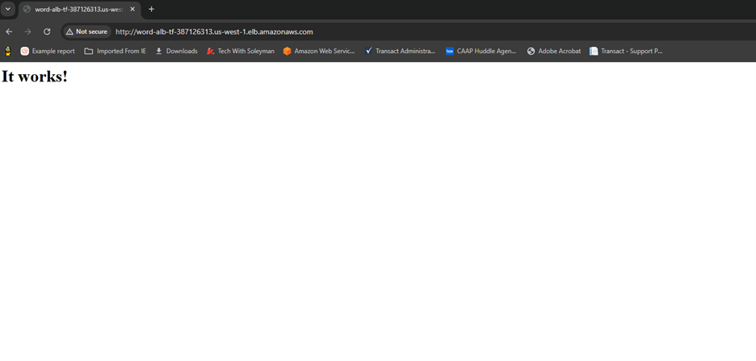
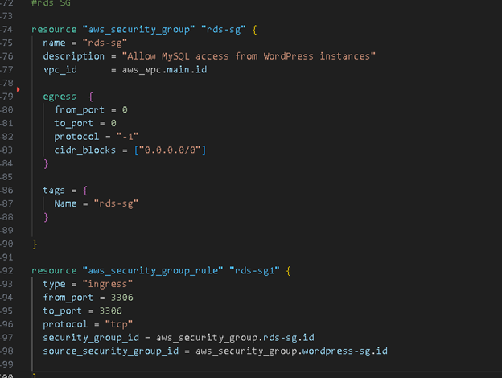
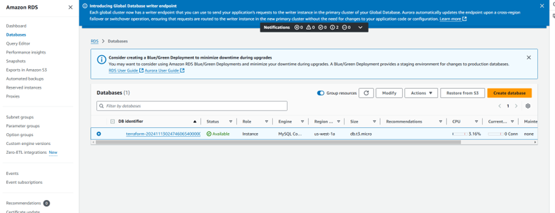
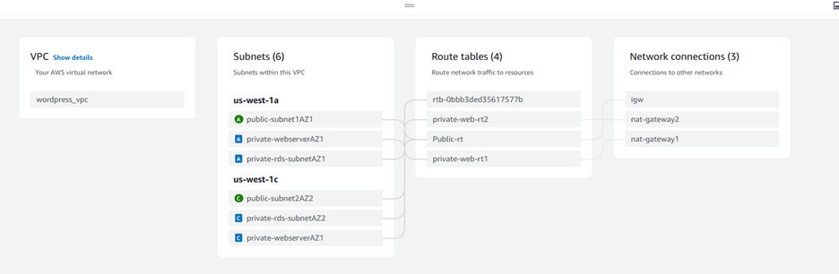

Architecture Overview

The goal of this project was to implement a secure and scalable WordPress deployment using AWS services. I designed a three-tier architecture to optimize performance and security, separating the web, application, and database layers. This setup not only enhances security but also improves scalability and fault tolerance by leveraging multiple Availability Zones (AZs).

Architecture Breakdown:

•	```Web Tier```: Application Load Balancer (ALB) and Bastion host in the public subnet.

•	```App Tier```: WordPress running on EC2 instances in private subnets.

•	```Database Tier```: Amazon RDS for MySQL in private subnets.

I followed a ```six-subnet``` setup across two AZs:

•	2 Public Subnets (1 in each AZ) for ALB and Bastion Host.

•	4 Private Subnets (2 in each AZ) for the EC2 Instances and RDS Database.


Learning from "Tokugero," I realized the importance of drawing out my architecture. It helped me visualize the different components and how they would connect, which is crucial for a scalable design.
                  
                   2. Setting Up the VPC and EC2 Instances
   
I started by provisioning a VPC with the subnets as planned. Then, I launched the EC2 instances: WordPress was set up on EC2 instances in the private subnets for better security.These instances were isolated from the internet, so I needed a way to access them securely. That's where the Bastion Host came in, allowing SSH access to my private instances.

                    3. Configuring the Application Load Balancer (ALB)
                    
To make WordPress accessible, I deployed an Application Load Balancer (ALB) in the public subnet: The ALB directs traffic to the Target Group, which contains my private EC2 instances.I set up health checks to ensure only healthy instances serve traffic. Everything seemed to be set up correctly, so I ran: ```terraform init```, ```terraform plan``` and ```terraform apply```.

At this point, I was able to access the ALB’s DNS in my browser, but I kept getting a ```502 Bad Gateway``` error. After some digging, I realized the issue: my private EC2 instances couldn’t connect to the internet.

                        4. Adding the ```NAT Gateway```
                        
The solution was to add a NAT Gateway: I placed the NAT Gateway in the public subnet. Updated the ```Route Tables``` for my private subnets to allow outbound traffic through the NAT Gateway.



This change allowed the private instances to reach the internet for updates and plugin installations. After updating the configurations, I ran Terraform again, and it finally worked—I could access WordPress via the ALB without issues!

                        
                        5. Deploying the RDS Database
                        
Next up was setting up a MySQL RDS database: I created an RDS Subnet Group to define which subnets my RDS instance would use. Added a Security Group to allow traffic only from the WordPress instances (on port 3306).Again, I ran:  ```terraform init```, ```terraform plan``` and ```terraform apply```. 

And just like that, my RDS instance was up and running, securely tucked away in the private subnets.


                                              Lessons Learned
                                              
                                              
1.	Visualize Your Architecture: Drawing out my infrastructure helped me catch missing pieces early. It’s a great habit I plan to stick with.

2.	NAT Gateway for Private Instances: I learned that if your private instances need outbound internet access (for updates, etc.), a NAT Gateway is essential.

3.	Security Best Practices:

o	Use ALB as the only entry point to your application.

o	Control access using Security Groups to ensure only necessary traffic gets through.

o	For future projects, I'll use AWS Secrets Manager or KMS for managing sensitive information like database credentials.

The Power of Persistence: Debugging was challenging, especially with the 502 errors, but I learned that sometimes, you need to destroy and redeploy resources to get things working. And don’t be afraid to ask for help or dive into documentation and tutorials.

    
