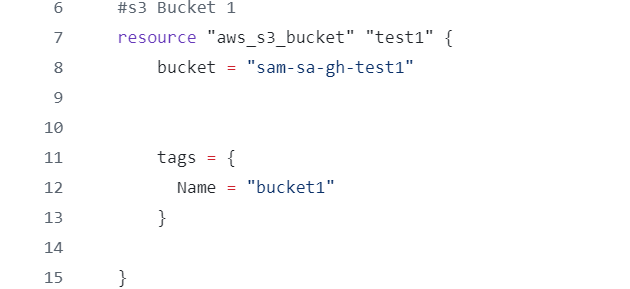
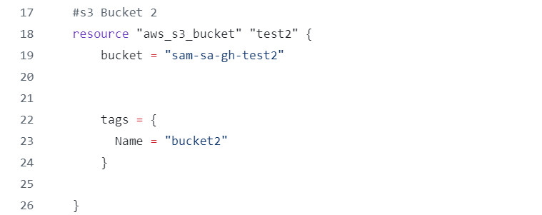
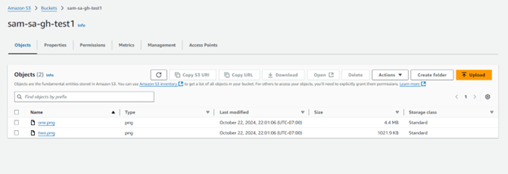
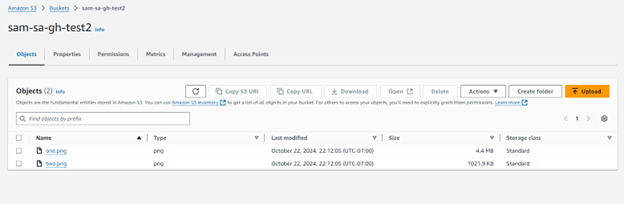

In this project, I focused on using the AWS CLI to create two S3 buckets, upload files to one, and transfer those files to another bucket.
I created two S3 buckets: ```sam-sa-gh-test1``` and ```sam-sa-gh-test2```, using Terraform documentation to set them up.
 
I uploaded files into ```sam-sa-gh-test``` using the CLI command ``` aws s3 cp /your saved file s3://sam-sa-gh-test1 --recursive```. This command uploads files from a directory. I also discovered the ```Datasync``` command for updating only new or modified files: ```aws s3 sync /your saved file s3://sam-sa-gh-test1 --recursive```. 


Next i copies the files from ```sam-sa-gh-test1``` to ```sam-sa-gh-test2``` using: ``` aws s3 cp s3://sam-sa-gh-test1/mypic s3://sam-sa-gh-test2/mypic --recursive```You can use the ```Datasync``` to managed updates between the two buckets. 



Since both buckets were within the same account and I had admin access, I didn't need to apply any additional policies to these S3 buckets.

I closed out the project by running the Terraform destroy command to clean up the resources I created.


